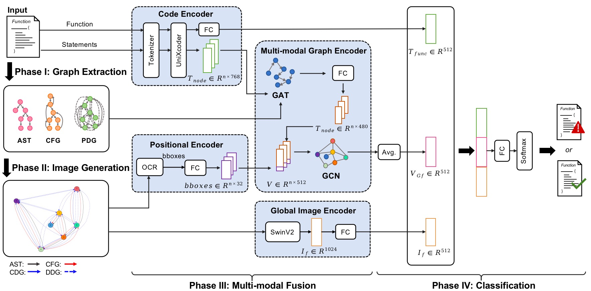

# Abundant Modalities Offer More Nutrients: Multi-Modal Based Function-level Vulnerability Detection

Software vulnerabilities are the weaknesses in software systems, which leads to serious cybersecurity problems. Recently, many deep learning-based approaches have been proposed to detect vulnerabilities at the function level by using one or a few different modalities (e.g., text representation, graph-based representation) of the function and have achieved promising performance. However, some of these existing studies have not completely leveraged these diverse modalities, particularly the underutilized image modality, and the others using images to represent functions for vulnerability detection have not made adequate use of the significant graph structure underlying the images.

In this paper, we propose MMVD, a multi-modal based vulnerability detection approach, which utilizes multi-modal features of the function (i.e., text representation, graph representation, and image representation) to build a function-level vulnerability detection model.Specifically, MMVD utilizes a pre-trained model (UniXcoder) to learn the semantic information of the textual source code, employs the graph neural network to distill graph-based representation, and makes use of computer vision techniques to obtain the image representation while retaining the graph structure of the function. To investigate the effectiveness of MMVD, we conduct a large-scale experiment (25,816 functions) by comparing it with four state-of-the-art baselines with the consideration of five performance measures.Experimental results demonstrate that MMVD improves four state-of-the-art baselines by 30.8\%-81.3\%, 12.8\%-27.4\%, 48.8\%-115\%, and 22.9\%-141\% in terms of F1-score, Accuracy, Precision, and PR-AUC respectively.

# Design of MMVD


<p align="center"> An overview architecture of MMVD </p> 

MMVD consists of four four main phases:

1.Graph Extraction: obtain the structure representation of the function. 

2.Image generation: helps to transform the structural graph into graphical representation.

3.Multi-modal feature fusion: builds the relationship of various modalities to obtain enriched code representations.

4.Classification: applied to detect whether a function is vulnerable or not. 

# Dataset

In our experiment, we choose the Big-Vul dataset provided by Fan, which is one of the largest vulnerability datasets collected from 348 open-source GitHub projects spanning 91 different vulnerability types. And we normalize the source code by performing three filtering steps on the Big-Vul dataset.Our final dataset contains 25,816 functions in total, including 4,069 vulnerable
functions and 21,747 non-vulnerable functions.
you can download the Big-Vul dataset and process it refer to `baselines/README.md`, or you can also download the preprocessed dataset from [HERE](https://drive.google.com/file/d/16tm5TU9CUCePFg6wJh2kz71SZylKv8zw/view?usp=sharing) and unzip it.

# Source Code

## Conda environment
Create Conda environment

    $ conda env create -f environment.yml

Activate the environment

    $ conda activate mmvd38

## Dataset process

We provide dataset processing scripts (including Graph Extraction and Image generation), please refer to `baselines/README.md` 


## Train SwinV2 model

The global image features were extracted by the `SwinV2 model`. For more details, please refer to our paper. Here we train the `swinV2 model`.

swinv2_base_patch4_window12to24_192to384_22kto1k_ft.pth can be download from https://github.com/microsoft/Swin-Transformer.

To train and test `SwinV2 model` , using the following commands.

```shell
cd mmvd

# train and finetune swinv2 using our generated images
CUDA_VISIBLE_DEVICES=2 python -m torch.distributed.launch --nproc_per_node 1 --master_port 12826  main.py --cfg configs/mySwin/swinv2_base_patch4_window24to28_384to448_1ktoMYDATA_ft.yaml --pretrained swinv2_base_patch4_window12to24_192to384_22kto1k_ft.pth --batch-size 4

# test swinv2
CUDA_VISIBLE_DEVICES=1 python -m torch.distributed.launch --nproc_per_node 1 --master_port 24093 main.py --cfg configs/mySwin/swinv2_base_patch4_window24to28_384to448_1ktoMYDATA_ft.yaml --batch-size 4 --test 1

```

## Train UniXcoder model: 

We train UniXcoder model to obtain the semantic information of the source code, please refer to `baselines/README.md`.

For convenience, we share a UniXcoder model [here](https://drive.google.com/file/d/1biGbJ4t3zxdYLw9-o_mPph8t_xVbW4RA/view?usp=sharing) trained by using our studied dataset.

## Use OCR: 

To obtain the positional feature embedding, we use OCR techniques to detect texts and positions from images, please refer to `OCR/README.txt` 

## Multi-modal feature fusion:

To train and test MMVD model, using the following commands. 

```shell
cd mmvd

# train
CUDA_VISIBLE_DEVICES=1 python -m torch.distributed.launch --nproc_per_node 1 --master_port 10055 main_bigvul.py --cfg configs/mySwin/swinv2_base_patch4_window24to28_384to448_1ktoMYDATA_ft.yaml --batch-size 4

# test
CUDA_VISIBLE_DEVICES=1 python -m torch.distributed.launch --nproc_per_node 1 --master_port 21129 main_bigvul.py --cfg configs/mySwin/swinv2_base_patch4_window24to28_384to448_1ktoMYDATA_ft.yaml --batch-size 4 --test 1

```


